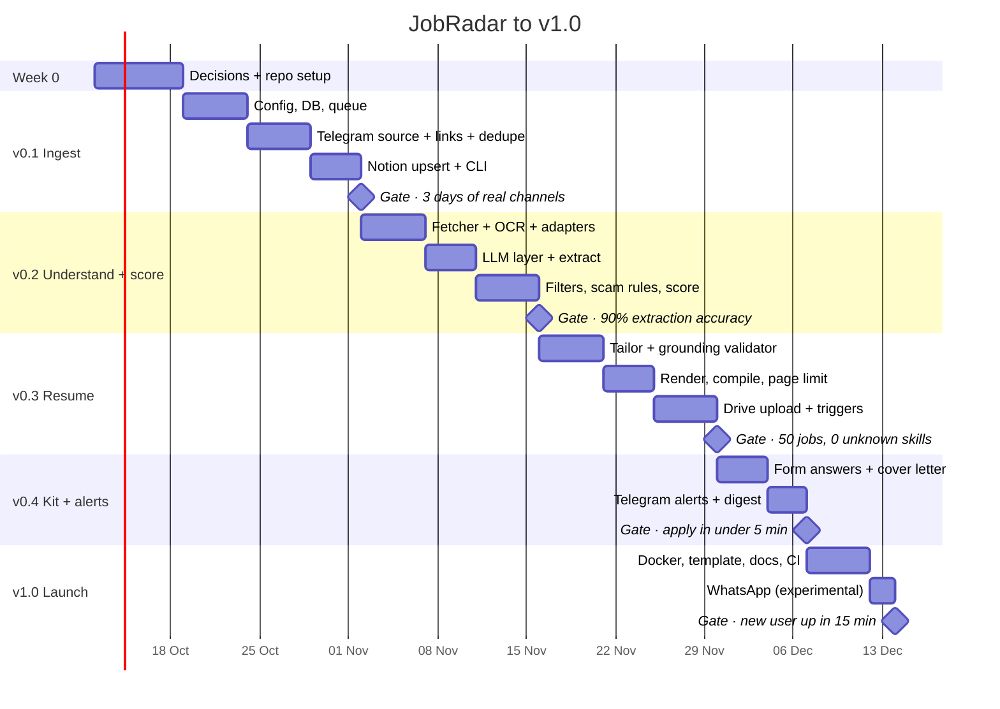
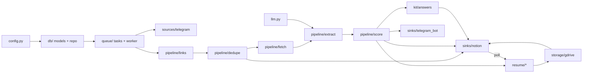

# JobRadar — Implementation Plan

_Created Oct 7, 2026 · targets v1.0 in 8 weeks + a setup week · one developer, part-time_

This plan turns the [PRD](docs/PRD.md), [HLD](docs/HLD.md) and [LLD](docs/LLD.md) into ordered, checkable work. Each release ends with an **exit gate** from the PRD; don't start the next release until the gate passes. File paths match the LLD module layout.

## Timeline

## How the pieces depend on each other

Build bottom-up: config → DB → queue first, because every later module is a task on that queue.

---

## Week 0 — Decisions and repo setup

**Open decisions to close first**

- [ ] Pick the PyPI distribution name (`job-radar` is taken; candidates `jobradar-agent`, `jobradar-ai`). Import name stays `jobradar`.
- [ ] Recommend a local Ollama model, or drop local mode from v1.
- [ ] Decide what happens when Drive is off: require it for resumes, or document an empty Resume link.
- [ ] Create the GitHub repo and fill `<owner>` in the README clone URL.

**Repo scaffolding**

- [x] `git init`, `.gitignore` (`.env`, `data/`, `output/`, `config/profile.yaml`, `*.session`)
- [x] `LICENSE` (MIT, with copyright holder)
- [x] `pyproject.toml` with uv: Python 3.11+, `src/jobradar` layout, `jobradar` console script (typer)
- [x] Dev tooling: ruff, mypy (strict on `src/`), pytest, pytest-asyncio, pre-commit
- [x] GitHub Actions skeleton: ruff, mypy, pytest, gitleaks
- [x] `.env.example`, `config.example.yaml`, `profile.example.yaml` copied from the LLD
- [ ] Create a test Telegram channel and a test Notion workspace for manual runs

**Done when:** `uv run jobradar --help` works and CI is green on an empty test suite.

---

## v0.1 Ingest (MVP) — weeks 1–2

Goal: every job from your channels lands in Notion once, without any AI.

**Foundation**

- [ ] `config.py`: `Settings` via pydantic-settings; load YAML + `.env`; fail fast with clear messages
- [ ] `db/models.py`: SQLModel tables `source`, `raw_message`, `job`, `job_source`, `artifact`, `task`, `llm_cache` (from the LLD schema)
- [ ] `db/repo.py`: all queries in one place; WAL and foreign keys on connect
- [ ] `db/migrations/`: alembic baseline
- [ ] `queue/tasks.py`: `enqueue()` (upsert on `(type, key)`), `claim()`, `complete()`, `fail()`
- [ ] `queue/worker.py`: async loop, backoff `min(30s·4^(n−1), 1h)` ±20%, `failed` after 5 attempts, reclaim `running` tasks older than 10 min
- [ ] `app.py`: wire sources, workers and scheduler; graceful shutdown

**Ingestion**

- [ ] `sources/base.py`: `IncomingMessage`, `Source` protocol, entry-point loader
- [ ] `sources/telegram.py`: resolve chats → `source` rows; catch-up from `last_msg_id` / `backfill_days`; live `NewMessage` handler; URLs from entities and buttons; photo download when there's no URL; `FloodWaitError` sleep; session file `chmod 600`
- [ ] `sources/bot_forward.py`: accept text, links and images forwarded by `TG_OWNER_CHAT_ID` only

**Pipeline**

- [ ] `pipeline/links.py`: `canonicalise()` with redirect following (5 hops, 5 s), tracking-param stripping, host denylist, short-link cache
- [ ] `pipeline/dedupe.py`: `sha1(canonical_url)` job ids; merge = `job_source` row only. Fingerprint merge is wired in v0.2, once company and role are extracted
- [ ] `process_message` task: message → URLs → new or merged job → `notion_upsert`

**Output**

- [ ] `sinks/notion.py` write path: find by Job ID, create/update, token bucket at 2.5 req/s, honour 429 `Retry-After`, 2,000-character splitting, agent-owned toggle in the page body
- [ ] Start-up Notion schema check that names any missing property
- [ ] Build the Notion template database with all properties and the 5 views

**CLI:** `init` (config copy + Telegram login + Notion check), `run`, `chats`, `add <url>`, `retry --failed`

**Tests**

- [ ] Unit: `canonicalise()` table (utm, fbclid, www, fragments, trailing slash, short links via respx)
- [ ] Unit: queue idempotency, backoff math, stuck-task reclaim
- [ ] Integration: fake source → SQLite → mock Notion

**Exit gate:** 3 days of real channels in Notion with under 5% duplicates.

---

## v0.2 Understand and score — weeks 3–4

Goal: every row has structured details and a trustworthy match score.

**Fetching**

- [ ] `pipeline/fetch.py`: httpx with 15 s timeout, 1 req/s per-domain semaphore, trafilatura; Playwright fallback under 400 characters; login-wall detection → `None`; SSRF guard (block private, loopback and link-local IPs and `file://`)
- [ ] `pipeline/adapters/generic.py` and `google_forms.py` (parse `FB_PUBLIC_LOAD_DATA_` into `FormField`s)
- [ ] `pipeline/ocr.py`: Tesseract for poster images when there's no link

**LLM layer**

- [ ] `llm.py`: LiteLLM + instructor `structured()`; Gemini default, Groq alternative; cache key `sha1(model|prompt_version|input)`; cost logged to `llm_cache.cost_inr`; daily budget pause until midnight IST; one repair retry on schema errors
- [ ] `prompts/extract.md`, `prompts/score.md` with `version:` headers; untrusted text inside tags

**Understanding and matching**

- [ ] `pipeline/extract.py`: page text (12k-character cap) + message + OCR → `JobPosting`; `confidence < 0.4` with no company or role → `discarded`; schema failure → `needs_review`
- [ ] Fingerprint dedupe after extraction (30-day window)
- [ ] `pipeline/score.py`: hard filters → `hidden` with reason; scam points (fee +3, gmail-only +1, unrealistic pay +1, urgency +1); LLM `ScoreResult`; route `hidden` / `new` / `notify_alert`
- [ ] Notion: fill Match Score, Scam Risk, Skills, Experience, Salary, Deadline, Work Mode, plus the match reason and requirements in the page body

**Tests**

- [ ] Collect and hand-label 100 real postings in `tests/fixtures/` (start in week 2; it takes a while)
- [ ] Golden test: per-field accuracy report; runs whenever a prompt version changes
- [ ] Unit: filters, scam rules, fingerprint `norm()`, SSRF guard
- [ ] Recorded HTTP (respx / vcrpy) for fetch; mock LLM for integration

**Exit gate:** over 90% extraction accuracy (role, company, deadline) on the 100 labelled jobs.

---

## v0.3 Resume — weeks 5–6

Goal: strong matches get a one-page, fully grounded PDF linked from Notion.

- [ ] Finalise the `profile.yaml` schema with ids on every experience, project and bullet; validate it at start-up
- [ ] `prompts/tailor.md`; `resume/tailor.py` → `TailoredResume` from `writer_model`
- [ ] Grounding validator: `ref_id`s exist; skills are a subset of profile skills (case-insensitive + alias map); numbers in rephrased bullets appear in the source bullet; violations dropped and logged
- [ ] `resume/render.py`: Jinja2 with `\VAR{}` / `\BLOCK{}` delimiters, `latex_escape()` on every string
- [ ] `templates/classic.tex.j2` and `modern.tex.j2`
- [ ] `resume/compile.py`: `tectonic --untrusted`, 60 s timeout; save `.log` on error; one retry with the plain template
- [ ] `resume/validate.py`: pypdf page count; trim the lowest-ranked bullet and recompile up to 3 times
- [ ] File naming `{company}_{role}_{yyyymmdd}_v{n}.pdf`
- [ ] `storage/local.py`; `storage/gdrive.py`: OAuth installed-app flow, monthly folders, link-sharing off, `webViewLink` → `artifact.drive_url`; refresh failure → keep local + notify
- [ ] **Triggers:** in `score.py`, `score ≥ auto_resume_above` and `scam_risk != high` → `build_resume` + `build_kit`; `sinks/notion.py` read path polls every 2 min, and Shortlisted with no resume → `build_resume`
- [ ] Notion: Resume = Drive link; the Status of auto-built jobs stays New
- [ ] CLI: `resume <job-id> [--template]` (new version), `init` adds Google OAuth

**Tests**

- [ ] Grounding validator with adversarial cases (invented skill, changed number, unknown `ref_id`)
- [ ] LaTeX escaping of every special character
- [ ] Each template compiles with `profile.example.yaml` across 10 sample jobs, at one page (added to CI)
- [ ] Trigger routing: auto threshold, Shortlisted, already-built job not rebuilt

**Exit gate:** one-page PDF and zero unknown skills across 50 jobs.

---

## v0.4 Apply kit and alerts — week 7

Goal: from a shortlisted job to a submitted form in under 5 minutes.

- [ ] `prompts/kit.md`; `kit/answers.py`: exact matches from `profile.answers` / `basics` first; generated answers otherwise (under 120 words, `[FILL IN: …]` when a fact is missing)
- [ ] Cover letter when the job asks for one or the Cover Letter checkbox is ticked (poller → `build_kit(cover_letter=true)`)
- [ ] Notion body: one code block per form answer, the cover letter, "Seen in" with message links
- [ ] `sinks/telegram_bot.py`: owner-only; alerts with role, company, score, deadline, reason, Notion link and resume link; shortlisted jobs closing within 24 h
- [ ] Digest at 09:00 and 19:00 IST: new, top matches, auto-built resumes, closing in 48 h, budget status
- [ ] Bot commands `/add`, `/status`, `/pause`, `/resume`
- [ ] CLI `stats [--days]`, `doctor`

**Exit gate:** timed run — open a shortlisted job, submit the real form, in under 5 minutes.

---

## v1.0 Public open-source launch — week 8

- [ ] `Dockerfile`: Python + Tectonic + Tesseract (+ Playwright Chromium or a separate `browser` service); pre-warm Tectonic packages for `classic`/`modern`
- [ ] `docker-compose.yml`: `jobradar`, `browser`; profiles `whatsapp` and `ollama`; volumes `./data`, `./output`, `./config`
- [ ] Publish the Notion template and link it from the README
- [ ] `wa-bridge/` Node sidecar + `sources/whatsapp.py` (local HTTP), off by default, with a ban-risk warning
- [ ] Docs: setup walkthrough with screenshots, Telegram / Notion / Google / Gemini key guides, troubleshooting, plugin authoring guide, `CONTRIBUTING.md`, `SECURITY.md`
- [ ] CI: Docker build, template compile, gitleaks, Dependabot
- [ ] Release: tag `v1.0.0`, publish the image and the PyPI package (under the chosen name)
- [ ] Fresh-machine test: someone new follows the README cold

**Exit gate:** a new user is running it in under 15 minutes.

---

## Definition of done (every task)

- Typed (mypy clean), linted (ruff), with tests for the new logic
- Idempotent if it runs as a task; safe to retry
- No secrets in logs; untrusted text only passed to the LLM inside delimiters
- Config options documented in `config.example.yaml`

## Risks to watch during the build

| Risk | Early signal | Response |
|---|---|---|
| Telegram account restriction | `FloodWaitError` frequency rising | Lower catch-up rate; never send from the user account |
| Extraction accuracy stalls below 90% | Golden report after week 3 | Add site adapters; tune `extract.md`; try a stronger `extract_model` |
| Gemini / Groq free-tier limits | 429s in logs | Raise budget, spread load, or switch provider in config |
| Auto-resume volume too high | Digest shows many auto-builds | Raise `auto_resume_above` |
| Tectonic cold start in Docker | Slow first compile, network errors | Pre-warm the package cache in the image |
| Notion rate limits | 429s during backfill | Rely on the limiter; batch body appends |

## Metrics to verify before v1.0

Duplicate rate under 5% · extraction accuracy over 90% · relevant jobs missed under 5% · apply time under 5 min · resume hallucination 0% · setup time under 15 min.
