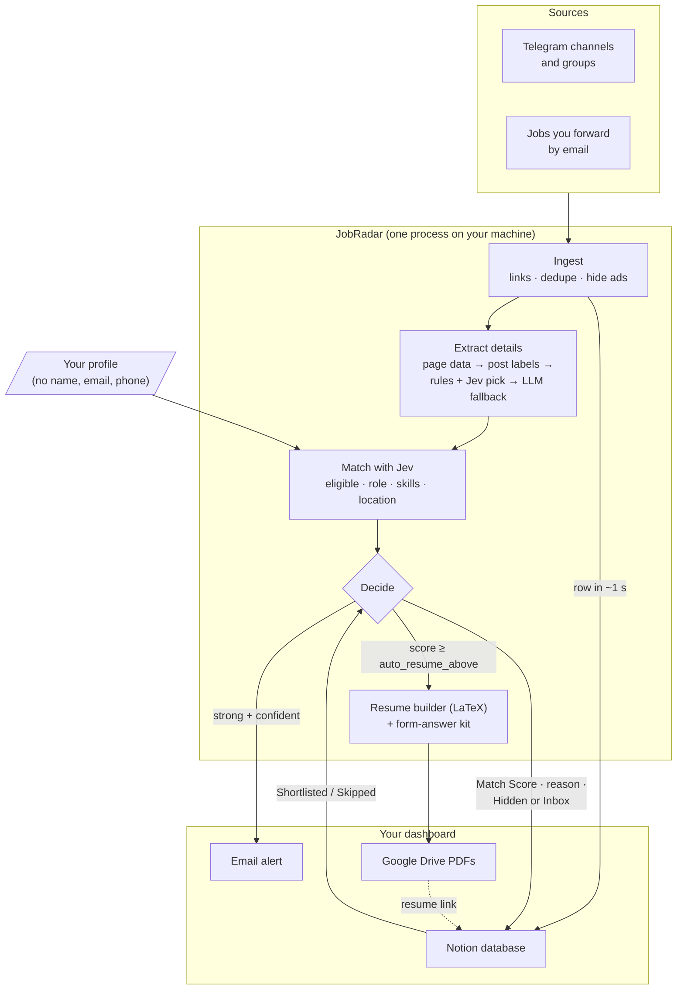

# JobRadar

**One inbox for every job posted in the groups you follow — deduplicated, ranked, and ready to apply.**

JobRadar is an open-source, self-hosted agent that watches your Telegram job channels, pulls out each job's details (free rules first, an LLM only when needed), judges how well every job fits your profile with **[Jev](https://typesafe.ai/blog/introducing-system-one-models-and-jev)**, emails you only about strong and certain matches, builds a tailored one-page LaTeX resume, and lays everything out in a Notion dashboard. You review and click Submit; JobRadar never applies for you.

> **Status:** v0.1 (Telegram → Notion, dedupe, ad filtering) and v0.2 part A (page reading with Gemini) work today. Jev matching and email alerts (v0.2 part B) are designed and next. See the [roadmap](#roadmap).

---

## Why

If you are a fresher in India, you probably follow 10–50 Telegram and WhatsApp groups that post hundreds of links a day. Most are duplicates, irrelevant, or scams. Good postings get missed, deadlines pass, and every application needs a resume tweak and the same form answers typed again.

JobRadar fixes that:

- **Never miss a posting.** Every followed channel is watched in real time, with backfill on first run.
- **One job, one row.** A job posted in 10 groups shows up once, with a "Seen In" count.
- **Ranked by fit.** Jev answers focused questions about each job (are you eligible, is it a role you want, do your skills cover it, does the location work), each with a confidence. Code turns them into a 0–100 Match Score with a reason: *Good fit · 82 · eligible ✓ · Python, SQL ✓ · missing Docker · Remote ✓*.
- **Free first.** Most details come from the job page's structured data and the post's own "Company: … Role: …" lines. An LLM is only called when those fall short.
- **Scams flagged.** Registration fees, personal-email-only HR and unrealistic pay raise a Scam Risk flag that is never hidden.
- **Tailored resumes, automatically.** Jobs scoring at or above your threshold get a one-page PDF built only from facts in your profile. A validator blocks any skill you don't have.
- **Apply in under 5 minutes.** Form answers are pre-written as copyable blocks on each Notion page, plus a cover letter on request.
- **Alerts you can trust.** An email only when a job is a strong match, Jev is confident, you're eligible and it isn't a likely scam. One email per job, a daily cap, plus closing-deadline reminders and a morning and evening digest.

## How it works



1. **Ingest:** messages from your channels are saved to a local SQLite queue before anything else happens, so nothing is lost on a restart. Links are expanded and cleaned, duplicates merged, channel ads hidden. The job appears in Notion within a second.
2. **Extract:** the job page is fetched, and details are filled cheapest first: structured data on the page, the post's own labels, rules that find candidate values with Jev picking the right one, and an LLM only if role or company is still missing.
3. **Match:** one Jev request per job answers eligibility, role fit, skills coverage, seniority and location, each with a confidence. Code combines them with your weights into a Match Score and a reason line. If Jev isn't available, an LLM or a skills-overlap rule takes over.
4. **Decide:** confidently ineligible jobs are hidden with the reason; likely scams are flagged and never emailed; uncertain matches go to the Inbox marked "unsure"; strong, confident matches also send an email.
5. **Build and apply:** strong matches (or any job you set to **Shortlisted**) get a tailored resume and form answers. Open the Notion page, read the reason, open the resume, copy the answers, submit.

## Notion dashboard

Each job is one page in a Notion database you duplicate from the JobRadar template.

| Property | What it shows |
|---|---|
| Role, Company, Location, Work Mode | Extracted from the posting |
| Match Score | 0–100 fit against your profile |
| Status | New → Shortlisted → Applied → Interview → Offer (plus Rejected, Skipped, Hidden) |
| Deadline | Application deadline, if stated |
| Skills, Experience, Salary | Extracted requirements |
| Apply Link | Canonical application URL |
| Resume | Google Drive link to the tailored PDF |
| Seen In | How many of your groups posted it |
| Scam Risk | Low / Medium / High |

Views included: **Inbox**, **Top matches**, **Closing soon**, **Board** (kanban by status) and **Applied**.

Anything you write outside the agent-owned "JobRadar" toggle on a page is never overwritten.

## Quick start

> These steps describe the v1.0 setup and will work once the first release ships.

**You need:** Docker, a Telegram account, a Notion account, a Google account (for Drive and email), and a free [Gemini](https://aistudio.google.com/) or [Groq](https://console.groq.com/) API key.

```bash
git clone https://github.com/ThePlator/JobRadar.git
```

(After v1.0 the CLI will also be on PyPI as `jobradar-agent`.)

```bash
cd JobRadar && cp .env.example .env && cp config.example.yaml config/config.yaml && cp profile.example.yaml config/profile.yaml
```

Fill in `.env`, `config/config.yaml` and `config/profile.yaml` (see [Configuration](#configuration)), then run first-time setup. It logs in to Telegram, runs the Google OAuth flow and checks your Notion database:

```bash
docker compose run --rm jobradar init
```

Start it:

```bash
docker compose up -d
```

Target: running in under 15 minutes on a laptop, home server or a 1 vCPU / 1 GB VPS.

## Configuration

JobRadar uses three files. All are validated at start-up, and a bad value stops the app with a clear message.

### `.env` — secrets only, never committed

| Variable | Where to get it |
|---|---|
| `TG_API_ID`, `TG_API_HASH` | [my.telegram.org](https://my.telegram.org) → API development tools |
| `EMAIL_ADDRESS`, `EMAIL_APP_PASSWORD` | Your email and an app password ([Gmail](https://myaccount.google.com/apppasswords)); used to send alerts and read forwarded jobs |
| `NOTIFY_TO` | Where alerts and digests go (defaults to `EMAIL_ADDRESS`) |
| `NOTION_TOKEN`, `NOTION_DATABASE_ID` | A Notion internal integration, shared with your duplicated database |
| `TYPESAFE_API_KEY` | [typesafe.ai](https://typesafe.ai) (early access): Jev matching. Optional; without it an LLM matches instead |
| `GEMINI_API_KEY` or `GROQ_API_KEY` | Google AI Studio or Groq console: fallback extraction and matching |
| `GDRIVE_FOLDER_ID` | The Drive folder that will hold your resumes |

### `config.yaml` — what to watch and how to filter

```yaml
sources:
  telegram:
    chats: ["@offcampusjobs", "@freshersjobs", -1001234567890]
    backfill_days: 3

llm:
  extract_model: "gemini/gemini-flash-latest"
  writer_model: "gemini/gemini-pro-latest"
  daily_budget_inr: 15

filters:
  batch_years: [2025, 2026]
  degrees: ["B.Tech", "BE", "MCA"]
  locations: ["Bengaluru", "Hyderabad", "Pune", "Remote"]
  max_experience_years: 1

scoring:
  hide_below: 40          # confident matches below this → Hidden
  alert_above: 75         # at or above, and confident and eligible → email alert
  auto_resume_above: 85   # at or above → resume built automatically (null = only on Shortlisted)

matching:                 # v0.2 B
  providers: [jev, llm, skills_rule]   # tried in order
  weights: {skills_coverage: 0.40, role_alignment: 0.30, seniority_fit: 0.15, location_ok: 0.15}
  min_confidence: 0.5     # below this: Inbox, marked "unsure", never emailed
```

Changing `weights` or thresholds re-ranks your jobs from stored answers, with no new model calls.

Run `jobradar chats` to list every chat your account can read, with the ids to paste here.

### `profile.yaml` — the only source of resume facts

Your education, skills, experience, projects (each bullet with an `id` and tags) and reusable form answers such as notice period and expected CTC. The resume builder can rephrase your bullets to match a job's wording, but it can't add skills, tools, numbers or claims that aren't in this file.

## CLI

| Command | What it does |
|---|---|
| `jobradar init` | Copy example configs, Telegram login, Google OAuth, Notion schema check |
| `jobradar run` | Start sources, workers and scheduler (Docker default) |
| `jobradar chats` | List Telegram chats you can read, with ids |
| `jobradar add <url>` | Process one link manually |
| `jobradar extract --missing` | Read (fetch + LLM) jobs listed before extraction was enabled |
| `jobradar stats [--days 3]` | Posts, jobs, reposts merged, likely duplicates, hidden ads, failed tasks |
| `jobradar resume <job-id> [--template modern]` | Rebuild a resume now |
| `jobradar retry --failed` | Re-queue failed tasks |
| `jobradar doctor` | Check keys, Tectonic, Playwright, Notion properties, Drive access |
| `jobradar stats [--days 7]` | Jobs seen, unique, hidden, shortlisted, applied, LLM spend |

You can also add jobs by forwarding any email, message text or link to your JobRadar mail folder (for Gmail: a `JobRadar` label with a filter).

## Privacy and safety

- **Runs on your machine.** Your profile, keys, Telegram session and PDFs stay local. Resumes are uploaded only to your own Google Drive, with link-sharing off.
- **Email stays narrow.** JobRadar uses an app password, emails only you, reads only its own folder, and accepts forwards only from your address.
- **Minimal data to providers.** Matching sends TypeSafe the job text and a compact profile (education, skills, experience, preferences), never your name, email or phone. Fallback extraction sends only job text to your LLM provider.
- **Read-only on Telegram.** JobRadar reads with your account but never sends messages, joins groups or messages recruiters.
- **You submit every application.** No auto-apply and no scraping behind logins.
- **Prompt-injection aware.** Job pages are passed to the LLM as delimited data, outputs are schema-validated, and the model has no tools.
- **Guard your session file.** `data/tg.session` gives full access to your Telegram account. It is `chmod 600` and git-ignored; never share it.

> You are responsible for following the terms of service of every platform you connect. The WhatsApp source uses an unofficial client that can get a number banned; it is off by default, and a spare number is strongly recommended.

## Cost

Most details come from free rules. Matching with Jev costs about ₹0.01 per job at TypeSafe's published price, which TypeSafe says may be subsidised. An LLM (about ₹0.10 per job with Gemini flash-lite) is only used when the rules fall short or Jev is unavailable. The target is under ₹300/month at 300 unique jobs a day. Dedupe runs before any model call, answers are cached, and a daily budget cap pauses model work when reached.

## Roadmap

| Release | Scope | Exit gate |
|---|---|---|
| **v0.1 Ingest (MVP)** ✓ | Telegram listener, link cleanup, dedupe, ad filtering, SQLite queue, one Notion row per job, `stats` | 3 days of real channels with under 5% duplicates (0.9% so far) |
| **v0.2 A Read jobs** ✓ | Page fetching, Gemini extraction, Notion columns and details | |
| **v0.2 B Match and alert** (next) | Free extraction layers, Jev matching with confidence, decide step, email alerts and digests | Over 90% extraction accuracy on 100 labelled jobs; alerts you would act on |
| **v0.2 C Text-only posts** | Posts without links, poster OCR, reposts with different links | |
| **v0.3 Resume** | profile.yaml, LaTeX templates, Tectonic, validator, Drive upload, auto + Shortlisted triggers | One-page PDF and zero unknown skills across 50 jobs |
| **v0.4 Apply kit** | Form answers, cover letter, forward-to-add by email | Shortlisted job to submitted form in under 5 minutes |
| **v1.0 Public launch** | Docker image, Notion template, docs, CI; WhatsApp as experimental | New user running in under 15 minutes |

## Documentation

- [Wiki](https://github.com/ThePlator/JobRadar/wiki): setup guide, Notion setup, configuration, commands, troubleshooting, FAQ
- [Product Requirements (PRD)](docs/PRD.md): goals, user stories, requirements, metrics, risks
- [High-Level Design (HLD)](docs/HLD.md): architecture, flows, integrations, deployment, security
- [Low-Level Design (LLD)](docs/LLD.md): schema, models, module specs, prompts, Notion mapping, plugins

## Tech stack

Python 3.11+ (asyncio) · Telethon · aiosmtplib + imap-tools · TypeSafe Jev (`typesafe-sdk`) · httpx · Playwright · trafilatura · Tesseract · LiteLLM + instructor · Jinja2 · Tectonic · SQLite + SQLModel · Notion API · Google Drive API · Docker · uv

## Contributing

JobRadar is built to be extended without touching the core. Four plugin points are discovered via Python entry points:

| Extension point | Built in | Ideas |
|---|---|---|
| `jobradar.sources` | telegram, email_forward, whatsapp | Job-alert emails, RSS, Discord |
| `jobradar.site_adapters` | generic, google_forms | Greenhouse, Lever, Workday public pages |
| `jobradar.storage` | local, gdrive | Dropbox, S3 |
| `jobradar.sinks` | notion, email_notify | Telegram bot, Slack, Google Sheets |

Resume templates are plain `.tex.j2` files in `templates/`. CI runs ruff, mypy, pytest, a compile check on every template, gitleaks and a Docker build.

Issues and pull requests are welcome. Start with [CONTRIBUTING.md](CONTRIBUTING.md), and please follow the [Code of Conduct](CODE_OF_CONDUCT.md). Changes are listed in [CHANGELOG.md](CHANGELOG.md); for help, see [SUPPORT.md](SUPPORT.md).

## Security

Found a vulnerability? Please report it privately, not in a public issue. See [SECURITY.md](SECURITY.md) for how, what's in scope, and what to do if a secret leaks.

## License

[MIT](LICENSE)
