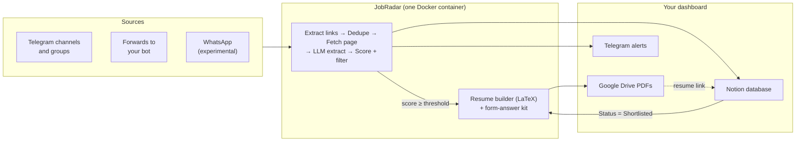

# JobRadar

**One inbox for every job posted in the groups you follow — deduplicated, ranked, and ready to apply.**

JobRadar is an open-source, self-hosted agent that watches your Telegram job channels, extracts every posting, scores it against your profile, builds a tailored one-page LaTeX resume for strong matches, and lays everything out in a Notion dashboard. You review and click Submit; JobRadar never applies for you.

> **Status: design phase.** The design docs are complete; code has not landed yet. See the [roadmap](#roadmap).

---

## Why

If you are a fresher in India, you probably follow 10–50 Telegram and WhatsApp groups that post hundreds of links a day. Most are duplicates, irrelevant, or scams. Good postings get missed, deadlines pass, and every application needs a resume tweak and the same form answers typed again.

JobRadar fixes that:

- **Never miss a posting.** Every followed channel is watched in real time, with backfill on first run.
- **One job, one row.** A job posted in 10 groups shows up once, with a "Seen In" count.
- **Ranked by fit.** Hard filters (batch year, degree, location, experience) plus an LLM match score from 0 to 100 with a short reason.
- **Scams flagged.** Registration fees, personal-email-only HR and unrealistic pay raise a Scam Risk flag that is never hidden.
- **Tailored resumes, automatically.** Jobs scoring at or above your threshold get a one-page PDF built only from facts in your profile. A validator blocks any skill you don't have.
- **Apply in under 5 minutes.** Form answers are pre-written as copyable blocks on each Notion page, plus a cover letter on request.
- **Alerts that matter.** Telegram pings for top matches and closing deadlines, plus a morning and evening digest.

## How it works



1. **Ingest:** messages from your channels are saved to a local SQLite queue before anything else happens, so nothing is lost on a restart.
2. **Understand:** links are expanded and cleaned, duplicates are merged, and the job page is fetched and turned into structured JSON by an LLM.
3. **Score:** your filters hide clear mismatches; the LLM scores the rest against your profile.
4. **Build:** jobs at or above `auto_resume_above` get a tailored resume and form answers. Setting any other job to **Shortlisted** in Notion builds one too.
5. **Apply:** open the Notion page, read the match reason, open the Drive resume link, copy the answers, submit.

## Notion dashboard

Each job is one page in a Notion database you duplicate from the JobRadar template.

| Property | What it shows |
|---|---|
| Role, Company, Location, Work Mode | Extracted from the posting |
| Match Score | 0–100 fit against your profile |
| Status | New → Shortlisted → Applied → Interview → Offer (plus Rejected, Skipped, Hidden) |
| Deadline | Application deadline, if stated |
| Skills, Experience, Salary | Extracted requirements |
| Apply Link | Canonical application URL |
| Resume | Google Drive link to the tailored PDF |
| Seen In | How many of your groups posted it |
| Scam Risk | Low / Medium / High |

Views included: **Inbox**, **Top matches**, **Closing soon**, **Board** (kanban by status) and **Applied**.

Anything you write outside the agent-owned "JobRadar" toggle on a page is never overwritten.

## Quick start

> These steps describe the v1.0 setup and will work once the first release ships.

**You need:** Docker, a Telegram account, a Notion account, a Google account (for Drive), and a free [Gemini](https://aistudio.google.com/) or [Groq](https://console.groq.com/) API key.

```bash
git clone https://github.com/<owner>/jobradar.git
```

```bash
cd jobradar && cp .env.example .env && cp config.example.yaml config/config.yaml && cp profile.example.yaml config/profile.yaml
```

Fill in `.env`, `config/config.yaml` and `config/profile.yaml` (see [Configuration](#configuration)), then run first-time setup. It logs in to Telegram, runs the Google OAuth flow and checks your Notion database:

```bash
docker compose run --rm jobradar init
```

Start it:

```bash
docker compose up -d
```

Target: running in under 15 minutes on a laptop, home server or a 1 vCPU / 1 GB VPS.

## Configuration

JobRadar uses three files. All are validated at start-up, and a bad value stops the app with a clear message.

### `.env` — secrets only, never committed

| Variable | Where to get it |
|---|---|
| `TG_API_ID`, `TG_API_HASH` | [my.telegram.org](https://my.telegram.org) → API development tools |
| `TG_BOT_TOKEN` | [@BotFather](https://t.me/BotFather) |
| `TG_OWNER_CHAT_ID` | Your own Telegram user id (alerts go only here) |
| `NOTION_TOKEN`, `NOTION_DATABASE_ID` | A Notion internal integration, shared with your duplicated database |
| `GEMINI_API_KEY` or `GROQ_API_KEY` | Google AI Studio or Groq console |
| `GDRIVE_FOLDER_ID` | The Drive folder that will hold your resumes |

### `config.yaml` — what to watch and how to filter

```yaml
sources:
  telegram:
    chats: ["@offcampusjobs", "@freshersjobs", -1001234567890]
    backfill_days: 3

llm:
  extract_model: "gemini/gemini-flash-latest"
  writer_model: "gemini/gemini-pro-latest"
  daily_budget_inr: 15

filters:
  batch_years: [2025, 2026]
  degrees: ["B.Tech", "BE", "MCA"]
  locations: ["Bengaluru", "Hyderabad", "Pune", "Remote"]
  max_experience_years: 1

scoring:
  hide_below: 40          # below this → Hidden
  alert_above: 85         # at or above → Telegram alert
  auto_resume_above: 85   # at or above → resume built automatically (null = only on Shortlisted)
```

Run `jobradar chats` to list every chat your account can read, with the ids to paste here.

### `profile.yaml` — the only source of resume facts

Your education, skills, experience, projects (each bullet with an `id` and tags) and reusable form answers such as notice period and expected CTC. The resume builder can rephrase your bullets to match a job's wording, but it can't add skills, tools, numbers or claims that aren't in this file.

## CLI

| Command | What it does |
|---|---|
| `jobradar init` | Copy example configs, Telegram login, Google OAuth, Notion schema check |
| `jobradar run` | Start sources, workers and scheduler (Docker default) |
| `jobradar chats` | List Telegram chats you can read, with ids |
| `jobradar add <url>` | Process one link manually |
| `jobradar resume <job-id> [--template modern]` | Rebuild a resume now |
| `jobradar retry --failed` | Re-queue failed tasks |
| `jobradar doctor` | Check keys, Tectonic, Playwright, Notion properties, Drive access |
| `jobradar stats [--days 7]` | Jobs seen, unique, hidden, shortlisted, applied, LLM spend |

You can also send `/add <url>`, `/status`, `/pause` and `/resume` to your JobRadar bot, or forward any job message to it.

## Privacy and safety

- **Runs on your machine.** Your profile, keys, Telegram session and PDFs stay local. Resumes are uploaded only to your own Google Drive, with link-sharing off.
- **Minimal LLM exposure.** Only job text and the profile fields a task needs are sent to the provider you choose.
- **Read-only on Telegram.** JobRadar reads with your account but never sends messages, joins groups or messages recruiters.
- **You submit every application.** No auto-apply and no scraping behind logins.
- **Prompt-injection aware.** Job pages are passed to the LLM as delimited data, outputs are schema-validated, and the model has no tools.
- **Guard your session file.** `data/tg.session` gives full access to your Telegram account. It is `chmod 600` and git-ignored; never share it.

> You are responsible for following the terms of service of every platform you connect. The WhatsApp source uses an unofficial client that can get a number banned; it is off by default, and a spare number is strongly recommended.

## Cost

With Gemini Flash or a Groq-hosted model for extraction, the target is under ₹300/month at 300 unique jobs a day, and free-tier keys should cover light use. Dedupe runs before any LLM call, results are cached per job, and a daily budget cap pauses LLM work when reached.

## Roadmap

| Release | Scope | Exit gate |
|---|---|---|
| **v0.1 Ingest (MVP)** | Telegram listener, link extraction, dedupe, SQLite, one Notion row per job | 3 days of real channels with under 5% duplicates |
| **v0.2 Understand and score** | Page fetching, LLM extraction, hard filters, match score, scam flags | Over 90% extraction accuracy on 100 labelled jobs |
| **v0.3 Resume** | profile.yaml, LaTeX templates, Tectonic, validator, Drive upload, auto + Shortlisted triggers | One-page PDF and zero unknown skills across 50 jobs |
| **v0.4 Apply kit and alerts** | Form answers, cover letter, Telegram alerts, daily digest | Shortlisted job to submitted form in under 5 minutes |
| **v1.0 Public launch** | Docker image, Notion template, docs, CI; WhatsApp as experimental | New user running in under 15 minutes |

## Documentation

- [Product Requirements (PRD)](docs/PRD.md): goals, user stories, requirements, metrics, risks
- [High-Level Design (HLD)](docs/HLD.md): architecture, flows, integrations, deployment, security
- [Low-Level Design (LLD)](docs/LLD.md): schema, models, module specs, prompts, Notion mapping, plugins

## Tech stack

Python 3.11+ (asyncio) · Telethon · python-telegram-bot · httpx · Playwright · trafilatura · Tesseract · LiteLLM + instructor · Jinja2 · Tectonic · SQLite + SQLModel · Notion API · Google Drive API · Docker · uv

## Contributing

JobRadar is built to be extended without touching the core. Four plugin points are discovered via Python entry points:

| Extension point | Built in | Ideas |
|---|---|---|
| `jobradar.sources` | telegram, bot_forward, whatsapp | Email inbox, RSS, Discord |
| `jobradar.site_adapters` | generic, google_forms | Greenhouse, Lever, Workday public pages |
| `jobradar.storage` | local, gdrive | Dropbox, S3 |
| `jobradar.sinks` | notion, telegram_bot | Google Sheets, Airtable |

Resume templates are plain `.tex.j2` files in `templates/`. CI runs ruff, mypy, pytest, a compile check on every template, gitleaks and a Docker build.

Issues and pull requests are welcome once v0.1 lands.

## License

[MIT](LICENSE)
