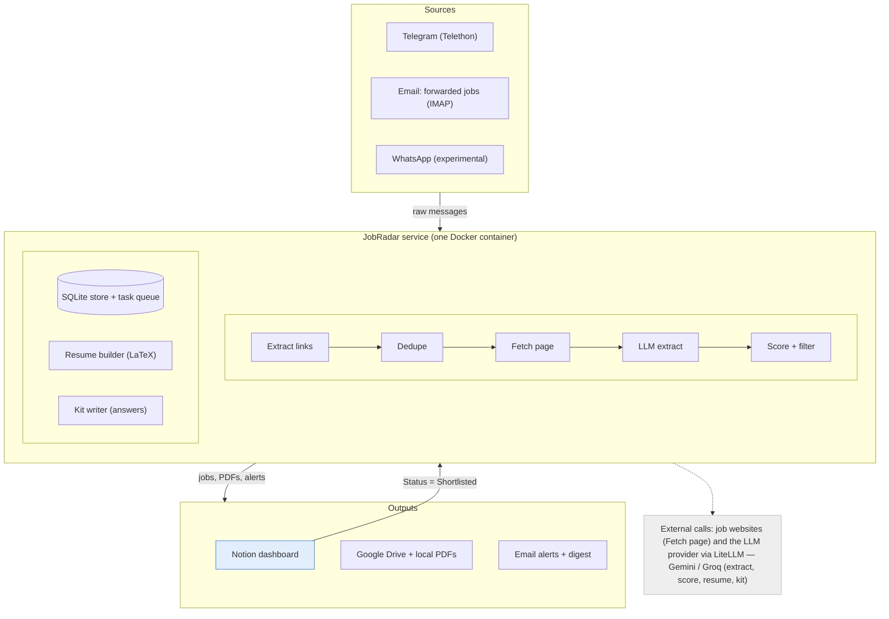
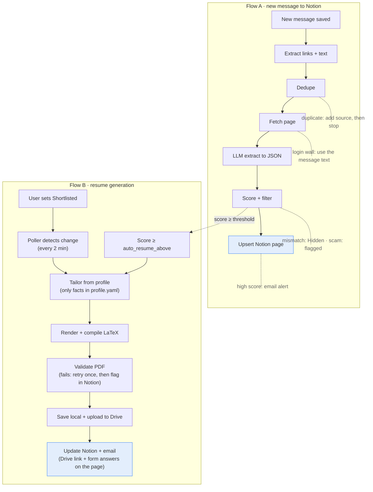
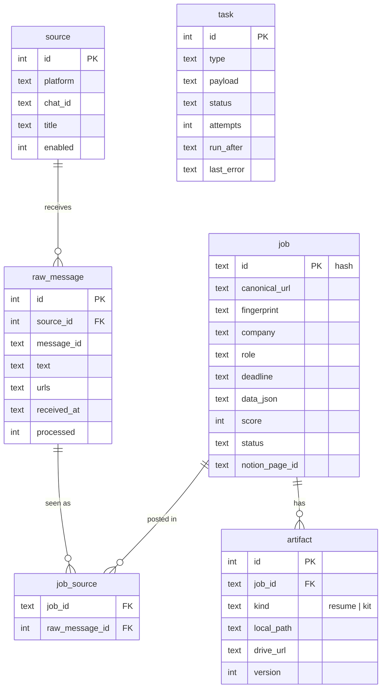
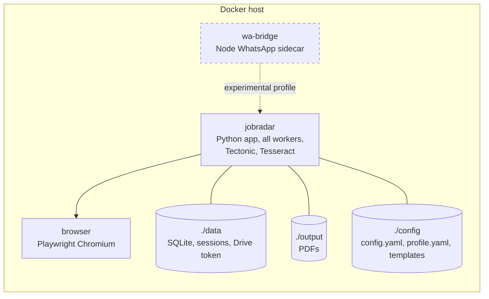

# JobRadar — High-Level Design (HLD)

_Oct 7, 2026_

## Summary and scope

JobRadar is a single self-hosted Python service built as an event-driven pipeline: sources push raw messages into a SQLite-backed queue, a chain of idempotent workers turns them into scored jobs, and sinks write results to Notion, Google Drive and email. Notion is both the dashboard and the control panel: a Status change there can trigger resume generation, and high-scoring jobs get a resume automatically.

This HLD covers v1.0 as defined in the [PRD](PRD.md): Telegram ingestion, extraction, dedupe, scoring, LaTeX resumes, Notion dashboard, Drive storage and email alerts. WhatsApp is an optional experimental source behind the same interface.

## Architecture

Messages flow down through one service; Notion sends shortlists back up.

Every pipeline step reads and writes the SQLite store through the task queue, so steps can retry independently. Notion is both an output and an input: the poller reads Status changes and queues resume and kit tasks. The scorer also queues a resume directly when a job scores at or above `auto_resume_above`.

## Components and responsibilities

| Component | Responsibility | Input → Output |
|---|---|---|
| Source adapters | Listen to Telegram (Telethon), read jobs you forward to an email folder (IMAP) and optionally WhatsApp; normalise messages | Platform events → `RawMessage` rows |
| Link extractor | Pull URLs from text, entities and buttons; expand short links; strip tracking params; OCR images | RawMessage → candidate URLs + text |
| Deduper | Canonical-URL hash and company+role+location fingerprint; attach extra sources to existing jobs | Candidates → new Job or merge |
| Fetcher | Download page with httpx; fall back to Playwright for JavaScript pages; skip login walls | URL → cleaned page text |
| Extractor (LLM) | Turn page and message text into the `JobPosting` JSON schema | Text → structured job |
| Scorer | Hard filters from config, LLM match score with reason, scam heuristics; queue auto-resume above threshold | Job + profile → score, status New or Hidden |
| Resume builder | Pick and rephrase profile content, render Jinja2 LaTeX, compile with Tectonic, validate | Job + profile → PDF |
| Kit writer | Draft answers for form fields and a cover letter | Job + profile → answers |
| Storage | Save PDFs locally; upload to Google Drive and return the online link | PDF → path + Drive link |
| Notion sync | Upsert job pages (write); poll for Status changes (read) | Job ↔ Notion page |
| Notifier | Email alerts (batched) and twice-daily email digest over SMTP | Events → emails |
| Scheduler and queue | Run workers, retries with backoff, periodic jobs (Notion poll, digest, cleanup) | Tasks → executions |
| Store | SQLite: messages, jobs, sources, tasks, artifacts | Shared state |

## Key flows

Every job lands in Notion; a high score or a Shortlisted status sends it on for a resume.

Flow A runs for every message within about 2 minutes. Flow B runs for jobs that score at or above the auto-resume threshold and for jobs the user shortlists by hand, which keeps LLM cost tied to likely applications.

## Data model overview

SQLite is the source of truth; Notion is a projection of it. Full column definitions are in the [LLD](LLD.md).

| Entity | Key fields | Notes |
|---|---|---|
| `source` | id, platform, chat_id, title, enabled | One per watched channel or group |
| `raw_message` | id, source_id, message_id, text, urls, received_at, processed | Unique on (source_id, message_id) |
| `job` | id (hash), canonical_url, fingerprint, company, role, deadline, data_json, score, status, notion_page_id | One row per real job |
| `job_source` | job_id, raw_message_id | Every place a job was seen |
| `artifact` | id, job_id, kind (resume, kit), local_path, drive_url, version | Resumes and kits per job |
| `task` | id, type, payload, status, attempts, run_after, last_error | Durable work queue |

The user profile lives in `profile.yaml`, not the database, so it can be edited and versioned by hand.

## External integrations

| Service | How | Auth | Limits to respect |
|---|---|---|---|
| Telegram (reading) | Telethon user client over MTProto | api_id + api_hash from my.telegram.org, session file | FloodWait errors; read-only, no auto-join |
| Email (notify + forwards) | SMTP (aiosmtplib, STARTTLS) to send; IMAP (imap-tools) to read one folder | Email address + app password | Provider send limits (Gmail about 500/day); alerts are batched, so a few dozen emails a day |
| WhatsApp (experimental) | Node sidecar with whatsapp-web.js or Baileys, posts messages to JobRadar over local HTTP | QR login | Unofficial; ban risk; off by default |
| LLM | LiteLLM — **Gemini (default) or Groq**; other hosted providers remain possible through LiteLLM config; local models are not supported in v1 | `GEMINI_API_KEY` or `GROQ_API_KEY` | Provider rate limits and free-tier quotas; cache by job id |
| Notion | Official API (notion-client), `Notion-Version: 2025-09-03` (data sources) | Internal integration token, database shared with it | About 3 requests/second; 2,000 characters per text item; 100 blocks per append |
| Google Drive | Drive API v3 | OAuth desktop flow, token stored locally | Per-user quota, ample for PDFs |
| Job websites | httpx, Playwright (Chromium) | None | 1 request/second per domain; obey robots.txt; skip login walls |

## Tech stack

| Layer | Choice | Why |
|---|---|---|
| Language | Python 3.11+, asyncio | Best libraries for Telegram, email, scraping and LLMs |
| Telegram | Telethon | Mature, async user client |
| Email | aiosmtplib, imap-tools | Works with any provider; no bot or app to install |
| HTTP / browser | httpx, Playwright, trafilatura (main-text extraction) | Fast path plus a JavaScript fallback |
| OCR | Tesseract via pytesseract (optional: vision LLM) | Free, offline |
| LLM | LiteLLM + Pydantic schemas (instructor); Gemini / Groq by default | Any provider, validated JSON, cheap fast defaults |
| Templates | Jinja2 with LaTeX-safe delimiters | Keeps LaTeX braces readable |
| LaTeX | Tectonic | Single binary, downloads packages on demand, small Docker image |
| Storage | SQLite (WAL mode) + SQLModel | Zero setup, enough for one user |
| Config | pydantic-settings, YAML + .env | Typed and validated at start |
| Dashboard | Notion API (notion-client) | No frontend to build or host |
| Packaging | Docker + docker compose, uv for dependencies | One-command install |
| Quality | pytest, ruff, mypy, GitHub Actions | Standard for open source |

## Deployment

One `docker compose up -d` starts everything on a laptop, a home server or a small VPS (1 vCPU, 1 GB RAM is enough with a hosted LLM).

| Container | Contents | Required |
|---|---|---|
| `jobradar` | Python app, all workers, Tectonic, Tesseract | Yes |
| `browser` | Playwright Chromium (or bundled in `jobradar`) | Yes, for JavaScript pages |
| `wa-bridge` | Node WhatsApp sidecar | No, experimental profile |

**Volumes:** `./data` (SQLite, session files, Drive token), `./output` (PDFs), `./config` (`config.yaml`, `profile.yaml`, templates).

**First run:** `jobradar init` creates config from examples, logs in to Telegram (code sent to the app), runs the Google OAuth flow, and checks the Notion database schema.

## Reliability, scaling and cost

### Reliability

- Every message is written to SQLite before any processing, so a crash loses nothing.
- Each step is a durable task row; workers are idempotent (keyed by message id or job id), so retries are safe.
- Retries use exponential backoff (30 s, 2 min, 10 min, 1 h); after 5 failures the task is marked failed and shown in a Notion "Errors" view or log.
- On restart, Telethon catches up from the last stored message id per chat.

### Scaling

- Target load (2,000 messages, 300 unique jobs a day) fits one process with about 4 concurrent fetch workers.
- Dedupe runs before any fetch or LLM call, so cost scales with unique jobs, not messages.
- Heavier users can swap SQLite for Postgres behind the same repository layer.

### Cost control

- Cheap fast model (Gemini Flash or a Groq-hosted model) for extraction and scoring; a stronger Gemini model only for resumes and answers.
- Resumes only for jobs at or above `auto_resume_above` or set to Shortlisted.
- Cache LLM results by job id and prompt version; never re-extract an unchanged job.
- Daily LLM budget in config; when hit, LLM tasks (including auto-resumes) pause and the digest says so.

## Security and privacy

- **Secrets** (API keys, tokens, the email app password) only in `.env`, loaded by pydantic-settings; never logged; `.env.example` ships with placeholders.
- **Telegram session file** gives full account access: stored in `./data` with permissions 600 and listed in `.gitignore`; docs warn never to share it.
- **Personal data** (`profile.yaml`, PDFs) stays local except the resume PDF uploaded to the user's own Drive. Only job text and the profile fields needed for a task are sent to the LLM.
- **Resume links:** Drive files keep link-sharing off, so the Notion Resume link opens only for the signed-in owner.
- **Untrusted input:** job pages and messages may contain prompt-injection text. They are passed to the LLM only as data inside delimiters, outputs are schema-validated, and the LLM has no tools or write access.
- **LaTeX injection:** every inserted value is escaped; Tectonic runs with shell-escape disabled.
- **Email:** use an app password, not the account password; JobRadar sends only to `NOTIFY_TO`, reads only one folder, and accepts forwards only from your own address with DKIM/SPF pass.
- **Outbound requests:** fetcher blocks private IP ranges and `file://` URLs to avoid SSRF from malicious links.
- **Repository hygiene:** gitleaks secret scanning in CI; Dependabot for dependency updates.

## Extensibility (plugin model)

Four extension points, each a small Python interface registered by entry points (`jobradar.sources`, `jobradar.storage`, `jobradar.sinks`, `jobradar.site_adapters`). Contributors add a module and a line in `pyproject.toml`; the core does not change.

| Extension point | Interface | Built-in implementations | Examples contributors could add |
|---|---|---|---|
| Source | `async def run(emit)` | telegram, email_forward, whatsapp (experimental) | job-alert emails (LinkedIn, Naukri), RSS, Discord |
| Site adapter | `match(url)`, `extract(page)` | generic, google_forms | Greenhouse, Lever, Workday public pages |
| Storage | `save(pdf) -> ref` | local, gdrive | Dropbox, S3 |
| Sink | `upsert(job)`, `poll_changes()` | notion, email_notify | Telegram bot, Slack, Google Sheets, Airtable |

LLM providers are pluggable through LiteLLM config, and resume templates are plain `.tex.j2` files in `templates/`.

## Design decisions and alternatives

| Decision | Chosen | Rejected alternative | Reason |
|---|---|---|---|
| License | MIT | AGPL-3.0 | Maximum adoption and contribution |
| Dashboard | Notion database | Custom React app, Streamlit | No frontend to build or host; duplicable template; works on phone |
| Telegram reading | User client (Telethon) | Bot API | Bots cannot read channels unless they are admins |
| Notifications | Email (SMTP) | Telegram bot | Every user already has email; no bot to create; digests read better as email and stay searchable; one less Telegram integration to secure |
| Manual job adds | Forward to an email folder (IMAP) | Forward to a Telegram bot | Same channel as notifications; works for jobs found anywhere, not just Telegram |
| Queue | SQLite task table | Redis + Celery | One user, one process; no extra service to run |
| Source of truth | SQLite, Notion as projection | Notion only | Notion is slow and rate-limited; local DB keeps dedupe fast and offline-safe |
| Resume trigger | Score ≥ `auto_resume_above`, or Status = Shortlisted | Shortlisted only; generate for every job | Strong matches are ready immediately; threshold keeps LLM cost and Drive clutter bounded |
| Resume in Notion | Online Drive link | Attach the PDF file to the page | Notion API file uploads are awkward; a Drive link opens anywhere, including on a phone |
| LaTeX engine | Tectonic | TeX Live | About 50 MB vs several GB in the Docker image |
| LLM access | LiteLLM, Gemini / Groq default | One provider SDK | Cheap or free defaults; users can still choose cost and privacy, including local models |
| Notion change detection | Polling every 2 minutes | Webhooks | Webhooks need a public URL; most users run at home |
| Applying | Human submits | Auto-fill and submit | Safer, honest, avoids bans and wrong submissions |
