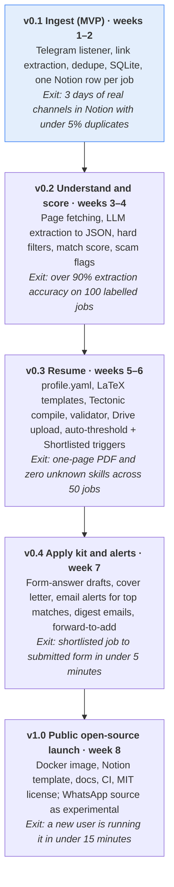

# JobRadar — Product Requirements Document (PRD)

_Oct 7, 2026_

## Overview

JobRadar is an open-source, self-hosted agent that watches job channels, extracts every posting, scores it against the user's profile, generates a tailored LaTeX resume, and lays everything out in a Notion dashboard so the user can apply in minutes.

**Problem.** Job seekers in India (especially freshers) follow 10–50 Telegram and WhatsApp groups that post hundreds of links a day. Most are duplicates, irrelevant, or scams. Good postings get missed, deadlines pass, and each application needs a resume tweak and the same form answers typed again.

**Vision.** One inbox for every job posted in any group the user follows: deduplicated, filtered, ranked, and ready to apply with a tailored resume and pre-written answers. The human always reviews and clicks Submit.

**Name:** JobRadar. **License:** MIT.

## Goals and non-goals

### Goals

1. Never miss a relevant posting from any followed Telegram channel or group.
2. Collapse duplicates so one job appears once, however many groups post it.
3. Rank jobs by fit with the user's profile and hide clear mismatches and scams.
4. Show every job in a Notion database with status, deadline and score.
5. Generate a one-page, tailored LaTeX resume per job, only from facts in the user's profile.
6. Pre-write answers for each application form field so applying takes under 5 minutes.
7. Be easy for anyone to self-host: one config, bring-your-own keys, Docker.

### Non-goals

- Auto-submitting applications. The user always submits.
- Scraping sites that require login (LinkedIn, Naukri accounts, Workday portals).
- A hosted SaaS version. Each user runs their own instance.
- Inventing skills, projects or experience the user does not have.
- Mass-messaging recruiters or joining groups automatically.

## Target users and personas

| Persona | Situation | What they need most |
|---|---|---|
| Fresher (primary) | Final-year or recent graduate, follows 20+ job/off-campus channels, applies to 10–30 jobs a week | Filtering by batch year and degree, deadlines, quick tailored resume |
| Early-career switcher | 1–3 years of experience, looking for better roles | High match-score filtering, tailored bullets per role |
| Self-hoster / contributor | Developer who runs it for themselves and adds features | Clean modules, plugin points, good docs, Docker setup |
| Placement cell / mentor (later) | Shares relevant jobs with a group of students | Read-only shared Notion view (out of scope for v1) |

## User stories

| ID | As a… | I want to… | So that… | Priority |
|---|---|---|---|---|
| US-01 | job seeker | add the Telegram channels and groups I follow in one config file | the agent watches all of them | P0 |
| US-02 | job seeker | see each new job as one row in Notion, even if 10 groups posted it | I am not flooded with duplicates | P0 |
| US-03 | job seeker | see role, company, eligibility, location, salary and deadline extracted | I can judge a job without opening the link | P0 |
| US-04 | job seeker | sort jobs by a match score against my profile | I apply to the best fits first | P0 |
| US-05 | job seeker | have mismatches (wrong batch, degree, location) and likely scams hidden | my inbox stays clean | P1 |
| US-06 | job seeker | get a tailored resume automatically for strong matches, and on demand when I set a job to Shortlisted | the best jobs are ready to apply to without waiting, and I can still pick any job by hand | P0 |
| US-07 | job seeker | copy pre-written answers for each form field from the job page | filling the form takes minutes | P1 |
| US-08 | job seeker | get an email alert only for top matches and closing deadlines, plus a morning and evening digest email | I hear about what matters without noise | P1 |
| US-09 | job seeker | store each resume locally and in Google Drive, linked from Notion | I have a record of what I sent and can open it from my phone | P1 |
| US-10 | job seeker | track status from New to Offer | I know where every application stands | P0 |
| US-11 | self-hoster | choose my LLM provider (Gemini or Groq by default) | I control cost and privacy | P1 |
| US-12 | self-hoster | start everything with one Docker command | setup takes under 15 minutes | P1 |
| US-13 | job seeker | optionally include WhatsApp groups (experimental) | jobs posted only on WhatsApp are also captured | P2 |
| US-14 | job seeker | forward a job email, message or link to JobRadar by email | I can add jobs from sources the agent does not watch | P1 |

## Functional requirements

### FR-1 Ingestion

- **FR-1.1** Read new messages from configured Telegram channels and groups using the user's own account (MTProto client), in real time.
- **FR-1.2** Backfill the last N days (configurable, default 3) on first run.
- **FR-1.3** Accept jobs the user forwards by email to a dedicated mail folder (text, link, image attachment), only from the user's own address.
- **FR-1.4** WhatsApp source, off by default and labelled experimental.

### FR-2 Extraction and dedupe

- **FR-2.1** Extract all URLs from message text, buttons and captions.
- **FR-2.2** Expand short links (bit.ly, lnkd.in, t.ly) and strip tracking parameters.
- **FR-2.3** Deduplicate by canonical URL, and by company + role + location fingerprint.
- **FR-2.4** Keep the list of every source group that posted the same job.
- **FR-2.5** Use the message text itself when there is no link; run OCR on job poster images.

### FR-3 Job understanding

- **FR-3.1** Fetch the job page (static or JavaScript-rendered); skip login-walled pages and fall back to message text.
- **FR-3.2** Use an LLM to return structured JSON: company, role, type, location, remote, experience, batch years, degrees, skills, salary, deadline, apply link, form questions.
- **FR-3.3** Flag likely scams (registration fee, payment request, personal-email-only HR, unrealistic pay).

### FR-4 Matching

- **FR-4.1** Apply hard filters from config (batch year, degree, location, experience range, excluded companies).
- **FR-4.2** Compute a 0–100 match score with a short reason.
- **FR-4.3** Mark filtered jobs as Hidden rather than deleting them.

### FR-5 Resume generation

- **FR-5.1** Generate automatically when the match score is at or above a configurable threshold (`scoring.auto_resume_above`, default 85), and also when the user sets Status to Shortlisted on a job that has no resume yet.
- **FR-5.2** Select and rephrase content only from the user's profile file; never add unlisted skills or projects.
- **FR-5.3** Render a LaTeX template and compile to a one-page PDF.
- **FR-5.4** Validate: compiles, one page, every skill exists in the profile.

### FR-6 Application kit

- **FR-6.1** Pre-write answers for each detected form field and common questions (why this company, notice period, expected CTC).
- **FR-6.2** Write a short cover letter when requested.

### FR-7 Storage and dashboard

- **FR-7.1** Save PDFs locally and upload them to Google Drive.
- **FR-7.2** Create or update one Notion page per job with properties and a page body (requirements, answers, resume link). The resume is linked by its online Drive URL, not attached as a file.
- **FR-7.3** Read Status changes back from Notion to trigger actions.

### FR-8 Notifications

- **FR-8.1** Email alert for jobs above the alert score, and for shortlisted jobs closing within 24 hours; alerts arriving close together are batched into one email.
- **FR-8.2** Morning and evening digest email with counts and a link to the Notion view.

## Non-functional requirements

| Area | Requirement |
|---|---|
| Latency | New message to Notion row in under 2 minutes (p95) |
| Throughput | Handle 2,000 messages and 300 unique jobs per day on a 1 vCPU / 1 GB machine |
| Reliability | No message lost on restart; every pipeline step retryable and idempotent |
| Cost | Under ₹300/month LLM cost at 300 jobs/day with Gemini Flash or Groq; free-tier keys should cover light use |
| Privacy | Profile, keys and session files stay on the user's machine; only job text and needed profile parts go to the chosen LLM |
| Security | Secrets only in `.env`; Telegram session file encrypted at rest or `chmod 600`; nothing secret in logs |
| Portability | Runs on Linux, macOS and Windows (WSL) via Docker; Python 3.11+ |
| Extensibility | New sources, LLM providers, storage targets and templates added as plugins without core changes |
| Observability | Structured logs, a run summary per day, and a failed-jobs view |
| Rate limits | Respect Notion (about 3 requests/second), Telegram flood limits, and site politeness (1 request/second per domain) |

## Notion dashboard requirements

The dashboard is a public Notion template that each user duplicates; JobRadar writes to it through a Notion integration token.

### Jobs database properties

| Property | Notion type | Written by |
|---|---|---|
| Role | Title | Agent |
| Company | Rich text | Agent |
| Match Score | Number (0–100) | Agent |
| Status | Select: New, Shortlisted, Applied, Interview, Offer, Rejected, Skipped, Hidden | Agent sets New/Hidden; user changes the rest |
| Deadline | Date | Agent |
| Location | Rich text | Agent |
| Work Mode | Select: Onsite, Hybrid, Remote | Agent |
| Experience | Rich text | Agent |
| Skills | Multi-select | Agent |
| Salary | Rich text | Agent |
| Apply Link | URL | Agent |
| Resume | URL (Google Drive link) | Agent |
| Seen In | Number of groups that posted it | Agent |
| Scam Risk | Select: Low, Medium, High | Agent |
| Job ID | Rich text (internal hash) | Agent |
| Added | Created time | Notion |

**Page body (per job):** match reason, full requirements, eligibility, form answers in copyable code blocks, cover letter, source messages.

### Views shipped in the template

- **Inbox:** Status = New, sorted by Match Score.
- **Top matches:** Score ≥ 80.
- **Closing soon:** Deadline within 3 days and Status not Applied.
- **Board:** Kanban grouped by Status.
- **Applied:** tracker with dates.

## Success metrics

| Metric | Target for v1.0 |
|---|---|
| Duplicate rate in Notion (same job twice) | Under 5% |
| Extraction accuracy (role, company, deadline correct) | Over 90% on a 100-job labelled sample |
| Relevant jobs missed vs manual scan | Under 5% |
| Time from opening a shortlisted job to submitting | Under 5 minutes |
| Resume hallucination rate (skill not in profile) | 0% (blocked by validator) |
| Setup time for a new user | Under 15 minutes with Docker |
| Open-source traction (6 months after launch) | 500 GitHub stars, 10 outside contributors |

## Release plan

Five releases reach a public v1.0 in about 8 weeks.

v0.1 is useful on its own: it solves the "too many groups to watch" problem before any AI is added. Durations are estimates for one developer working part-time.

## Risks, constraints, legal and ethics

| Risk | Impact | Mitigation |
|---|---|---|
| WhatsApp has no official API for reading groups or channels; unofficial clients break its terms | User's number can be banned | Off by default, marked experimental, recommend a spare number; manual forward by email as the safe path |
| Telegram account restriction | Loss of the user's main account | Read-only use, no auto-join or messaging, respect flood waits |
| Alert emails land in spam or flood the inbox | Missed top matches | Send from the user's own account to themselves; batch alerts; `List-Id` header for a filter/label |
| Email app password leaks | Mailbox access | App password only in `.env`; revocable per app; JobRadar reads one folder and never deletes mail |
| Job sites change layout or block scraping | Missing details | Fall back to message text; generic extractor first, site adapters second |
| LLM invents resume content | User sends false claims | Profile-only generation + validator that rejects unknown skills; user reviews every PDF |
| LLM cost grows with volume (auto-generated resumes add to it) | Users stop running it | Cheap model for extraction; resumes only above the auto threshold or on Shortlisted; daily budget cap; cache by job ID |
| Notion rate limits (about 3 req/s) and 2,000-character text blocks | Slow or failed writes | Write queue with backoff; split long text into blocks |
| Scam jobs reach the user | Financial harm | Scam heuristics + Scam Risk property; never hide the flag |
| Leaked secrets in a public repo | Account takeover | `.gitignore` for `.env`, sessions, profile, output; secret scanning in CI |
| Terms of service of sources | Legal exposure for users | README states users are responsible for following each platform's terms; no login-wall scraping |

**Ethics principles:** the human submits every application; no fabricated content; personal data goes only to the provider the user picks.

## Decisions (resolved open questions)

| Question | Decision |
|---|---|
| License | **MIT** (maximum adoption) |
| Default LLM | **Gemini** (default) or **Groq** via LiteLLM — Gemini Flash for extraction and scoring, a stronger Gemini model for resumes and answers |
| Resume trigger | **Auto-generate at or above `auto_resume_above`** (default 85); Shortlisted still triggers a build for jobs below it |
| Resume in Notion | **Online link** (Google Drive `webViewLink`), not a file attachment |
| Project name | **JobRadar**; PyPI package **`jobradar-agent`** (CLI and import stay `jobradar`) |
| Notifications | **Email** (SMTP) instead of a Telegram bot; manual adds by forwarding to an email folder. Telegram remains the job source |

### Still open

- **Local model:** which Ollama model to recommend for free/private mode, or drop local mode from v1.
- **Drive opt-out:** with link-only resumes, a user who disables Drive gets no openable Resume link in Notion. Either require Drive for resumes or document the limitation.
